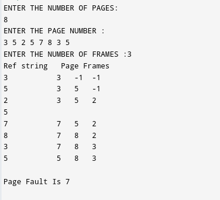
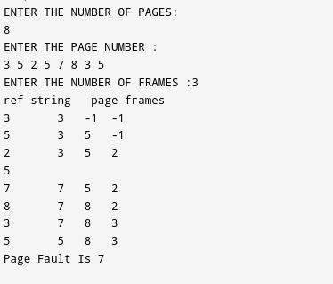

# OS-EX.10-IMPLEMENTATION-OF-PAGE-REPLACEMENT-ALGORITHMS

## PAGE REPLACEMENT ALGORITHM (FIFO)

## AIM: 
To write a C program to implement Page Replacement technique using FIFO

## ALGORITHM:
1. Start the program.

2. Get the number of pages and their sequence from the user

3. Get the number of available page frames from the user.

4. In FIFO, on the basics of first in first out, replace the pages respectively, then find number of page faults occurred.

5. Compare all frames with incoming page6. If the incoming page is already available in page frame, set the match flag to indicate ‘no need of page replacement’.

6. If the incoming page is not available in all frames, then remove the page which is loaded into the memory long back and give space for new incoming page.

7. Increment the ‘number of Page faults counter

8. Print the number of page faults.

9. Stop the program.

## PROGRAM:
```
#include<stdio.h>
int main()
{
int i,j,n,a[50],frame[10],no,k,avail,count=0;
printf("\n ENTER THE NUMBER OF PAGES:\n");
scanf("%d",&n);
printf("\n ENTER THE PAGE NUMBER :\n");
for(i=1;i<=n;i++)
scanf("%d",&a[i]);
printf("\n ENTER THE NUMBER OF FRAMES :");
scanf("%d",&no);
for(i=0;i<no;i++)
frame[i]= -1;
j=0;
printf("\tRef string\t Page Frames\n");
for(i=1;i<=n;i++)
{
printf("%d\t\t\t",a[i]);
avail=0;
for(k=0;k<no;k++)
if(frame[k]==a[i])
avail=1;
if (avail==0)
{
frame[j]=a[i];
j=(j+1)%no;
count++;
for(k=0;k<no;k++)
printf("%d\t",frame[k]);
}
printf("\n");
}
printf("\nPage Fault Is %d",count);
return 0;
}
```
## OUTPUT:


## RESULT:
Thus the implementation of FIFO page replacement is successfully executed.
<br>
<br>

## PAGE REPLACEMENT ALGORITHM (LRU)

## AIM:
To write a C program to implement Page Replacement technique using LRU

## ALGORITHM:
1. Start the program

2. Get the number of pages and their sequence from theuser

3. Get the number of available page frames from theuser.

4. In LRU replace the page that has not been used for the longest period oftime.

5. Compare all frames with incoming page6. If the incoming page is already available in page frame, set the match flag to indicate ‘no need of page replacement’.

6. If the incoming page is not available in all frames, then remove the page which has not been used for the longest period oftime.

7. Increment the ‘number of Page faults’ counter

8. Print the number of page faults.

9. Stop the program.

## PROGRAM:
```
#include<stdio.h>
main()
{
int q[20],p[50],c=0,c1,d,f,i,j,k=0,n,r,t,b[20],c2[20];
printf("Enter no of pages: \n");
scanf("%d",&n);
printf("Enter the reference string: \n");
for(i=0;i<n;i++)
scanf("%d",&p[i]);
printf("Enter no of frames: \n");
scanf("%d",&f);
q[k]=p[k];
printf("\t\n\t %d\n",q[k]);
c++;
k++;
for(i=1;i<n;i++)
{
c1=0;
for(j=0;j<f;j++)
{
if(p[i]!=q[j])
c1++;
}
if(c1==f)
{
c++;
if(k<f)
{
q[k]=p[i];
k++;
for(j=0;j<k;j++)
printf("\t%d",q[j]);
printf("\n");
}
else
{
for(r=0;r<f;r++)
{
c2[r]=0;
for(j=i-1;j<n;j--)
{
if(q[r]!=p[j])
c2[r]++;
else
break;
}
}
for(r=0;r<f;r++)
b[r]=c2[r];
for(r=0;r<f;r++)
{
for(j=r;j<f;j++)
{
if(b[r]<b[j])
{
t=b[r];
b[r]=b[j];
b[j]=t;
}
}
}
for(r=0;r<f;r++)
{
if(c2[r]==b[0])
q[r]=p[i];
printf("\t%d",q[r]);
}
printf("\n");
}
}
}
printf("\nThe no of page faults is %d",c);
}
```
## OUTPUT:


## RESULT:
Thus the implementation of LRU page replacement is successfully executed.
<br>
<br>

## PAGE REPLACEMENT ALGORITHM (OPR)

## AIM:
To write a C program to implement Page Replacement technique using OPR.

## ALGORITHM:
1. Start the program.

2. Take the input of pages as an array.

3. Look for the page allocated is present in near future, if no then replace that page in the memory with new page, If page already present increment hit, else increment miss.

4. Repeat till we reach the last element of the array.

5. Print the number of hits and misses.

6. Stop the program.

## PROGRAM:
```
#include<stdio.h>
int main()
{
int i,j,n,a[50],frame[10],no,k,avail,count=0;
printf("\n ENTER THE NUMBER OF PAGES:\n");
scanf("%d",&n);
printf("\n ENTER THE PAGE NUMBER :\n");
for(i=1;i<=n;i++)
scanf("%d",&a[i]);
printf("\n ENTER THE NUMBER OF FRAMES :");
scanf("%d",&no);
for(i=0;i<no;i++)
frame[i]= -1;
j=0;
printf("\tref string\t page frames\n");
for(i=1;i<=n;i++)
{
printf("%d\t\t",a[i]);
avail=0;
for(k=0;k<no;k++)
if(frame[k]==a[i])
avail=1;
if (avail==0)
{
frame[j]=a[i];
j=(j+1)%no;
count++;
for(k=0;k<no;k++)
printf("%d\t",frame[k]);
}
printf("\n");
}
printf("Page Fault Is %d",count);
return 0;
}
```
## OUTPUT:


## RESULT:
Thus the implementation of OPR page replacement is successfully executed.


